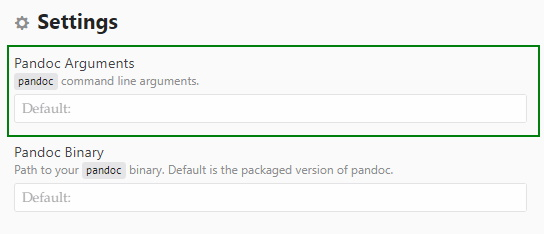

# `pandoc-convert-plus`

## A plugin for the [Atom](https://atom.io/) text editor to unleash the full power of [Pandoc](https://pandoc.org/), and quickly convert your documents in style

`pandoc-convert-plus` is a fork of the `pandoc-convert` plugin for Atom that gives more flexibility to the user, by allowing them to invoke pandoc with additional arguments.

The original `pandoc-convert` plugin allowed a user to quickly use pandoc to convert their documents to many different formats with the `Ctrl + P` command in atom, as shown here :

However, `pandoc-convert` had one limitation : it didn't allow users to use a set of arguments with the pandoc command that the plugin executed.

With pandoc-convert-plus, **you can now use any arguments that you want with pandoc**. This allows you to customize how pandoc will convert your document.

## Where do I specify the additional arguments ?

Simply go into the settings of Atom, and then the settings of the package. You'll find a text field to add your arguments.

## Is there a particular syntax for the arguments ?

**No ! Just add them like you would in a Pandoc command through a terminal/command prompt.**

Here is an example of some arguments to use a bibliography file, to remove the label of figures, and to use the xelatex engine to generate `.pdf` files :

`--citeproc --bibliography=C:/User/Bibliography/Bibliography_file.bib -fmarkdown-implicit_figures --pdf-engine=xelatex`

> ⚠️ **Be careful about spaces and special characters in the file paths present in your arguments**. They might lead to issues with Pandoc.

## Some examples of useful arguments to use with pandoc-convert-plus

### Bibliography

**Do you have a single bibliography database that you use in many markdown (`.md`) notes ?**

If that's so, you can use pandoc-convert-plus to automatically use the citeproc plugin of pandoc along with a .bib file containing your bibliography for all of your conversions.

Here is an example of the arguments that you might use to that end :

`--citeproc --bibliography=C:/User/Bibliography/Bibliography_file.bib`

### Removing the label of figures

Just use `-fmarkdown-implicit_figures`, *et voila* !

### Using another pdf engine

For example, you can use `xelatex` with the argument `--pdf-engine=xelatex`.

### Other arguments

Pandoc have an incredible number of options, allowing you to use [LaTeX templates](https://pandoc.org/MANUAL.html#templates) among many other things. If you want to know more, just check the [manual of Pandoc](https://pandoc.org/MANUAL.html).

## Other infomations about the plugin

Since `pandoc-convert-plus` is just a tiny modification of the original `pandoc-convert`, please check the [repository page of `pandoc-convert`](https://github.com/josa42/atom-pandoc-convert) for more information about its functioning.
